[简体中文](README.md) | **English**

<picture>
  <source media="(max-width: 640px) and (prefers-color-scheme: dark)" srcset="assets/presentation/hero-mobile-dark.svg">
  <source media="(max-width: 640px)" srcset="assets/presentation/hero-mobile-light.svg">
  <source media="(prefers-color-scheme: dark)" srcset="assets/presentation/hero-dark.svg">
  
</picture>

**agent-explain turns Markdown coding plans into step-by-step projections of token ranges, action-verb counts, risk labels and referenced files before execution.**

`Python 3.12+` · [MIT](LICENSE) · [GitHub](https://github.com/SuperMarioYL/agent-explain) · [Website](https://agent-explain.lei6393.com)

## Why it helps

Reading a file, editing code and deleting configuration deserve separate attention during plan review. The tool organizes those actions and their estimation basis so you can identify steps that need a closer look. It analyzes plan text without executing its commands.

The three-step example covers Read, Edit and Delete. Their labels are low, medium and high; auth.py remains unchanged.

<picture>
  <source media="(max-width: 640px) and (prefers-color-scheme: dark)" srcset="assets/presentation/process-mobile-dark.svg">
  <source media="(max-width: 640px)" srcset="assets/presentation/process-mobile-light.svg">
  <source media="(prefers-color-scheme: dark)" srcset="assets/presentation/process-dark.svg">
  
</picture>

## Architecture

`parser.py` tries numbered headings, numbered lists and paragraphs in that order, extracting verbs and paths. `analyzer.py` combines token estimation with risk rules; `projector.py` sums token bounds and risks and deduplicates paths. `renderer.py` emits a table or JSON.

The CLI passes the plan directory to the sampler. Paths are resolved there first, then tried as written; directories are not sampled as regular files.

<picture>
  <source media="(max-width: 640px) and (prefers-color-scheme: dark)" srcset="assets/presentation/architecture-mobile-dark.svg">
  <source media="(max-width: 640px)" srcset="assets/presentation/architecture-mobile-light.svg">
  <source media="(prefers-color-scheme: dark)" srcset="assets/presentation/architecture-dark.svg">
  
</picture>

## Install

Requires Python 3.12+. Install from source to obtain the examples:

```bash
git clone https://github.com/SuperMarioYL/agent-explain.git
cd agent-explain
python3 -m venv .venv
source .venv/bin/activate
python -m pip install -e .
```

Installation and first tokenizer initialization may download resources. No model API key is required.

## Quickstart

The repository supplies `examples/presentation/plan.md` and its referenced `auth.py`:

```bash
cat examples/presentation/plan.md
bash docs/demo.sh
```

The actual JSON totals are `est_tokens_range=[15,60]`, `total_tool_calls=3` and `total_files_touched=2`. The first two steps use a sampled basis; deletion uses static text. The absent obsolete.json is a path in the plan, not a file the tool creates or deletes.

## Usage

```bash
agent-explain explain examples/plan.md
agent-explain explain examples/plan.md --json
agent-explain explain examples/plan.md --json | jq .totals
agent-explain explain examples/plan.md --json | jq '.steps[] | select(.risk_class == "high")'
agent-explain --version
```

The v0.6.0 CLI requires the `explain` subcommand. JSON can feed your own approval program; this repository does not ship an executable named pre-approval-gate.

## Capabilities and integrations

| Stage | Provided capability |
|---|---|
| Markdown plans | Numbered headings, lists and paragraph parsing |
| Local files | Regular-file sizes inform estimates |
| Terminal review | Rich step table |
| External approval program | JSON projection; policy belongs to the integration |

<picture>
  <source media="(max-width: 640px) and (prefers-color-scheme: dark)" srcset="assets/presentation/integrations-mobile-dark.svg">
  <source media="(max-width: 640px)" srcset="assets/presentation/integrations-mobile-light.svg">
  <source media="(prefers-color-scheme: dark)" srcset="assets/presentation/integrations-dark.svg">
  
</picture>

## Configuration and limits

No model or service configuration is required. Text uses tiktoken; file estimation assumes roughly one token per four bytes. The sampled upper-bound multiplier is 1.6 and static is 2.0; confidence is fixed at 0.70 and 0.40 respectively.

These are implementation heuristics, not statistical confidence intervals. `tool_call_count` counts distinct action verbs. The highest matching English-keyword risk wins; unmatched text defaults to low, which does not establish that Chinese or unknown actions are safe.

## Recorded demo

[Complete inputs and actual output](docs/demo-results.json) · [Reproduction script](docs/demo.sh)

The [historical terminal recording](assets/demo.gif) and [recording script](docs/demo.tape) remain available. The recording was not remade for this documentation refresh; use the replayable JSON example above for current syntax and results.

## Roadmap

- [x] Markdown steps, action verbs and path extraction.
- [x] Heuristic token ranges, risk rules and file sampling.
- [x] Table/JSON output, path deduplication and totals.
- [ ] Calibrate estimates against real execution data.
- [ ] More native agent plan formats and IDE/MCP integrations.

Unchecked items are not current capabilities.

## Development and license

```bash
python -m pip install pytest
python -m pytest
```

[MIT](LICENSE) · [Issues](https://github.com/SuperMarioYL/agent-explain/issues)
