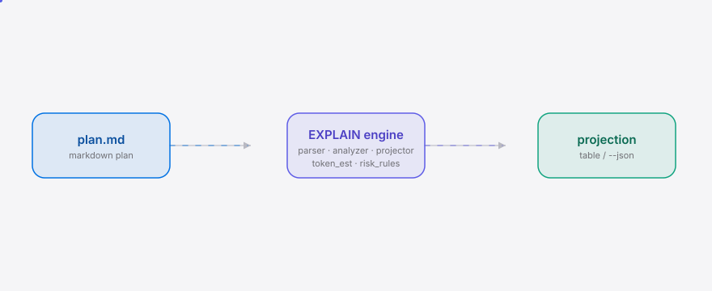

<div align="right"><sub><a href="./README.en.md">English</a>&nbsp;&nbsp;⇄&nbsp;&nbsp;<b>中文</b></sub></div>

<picture>
  <source media="(prefers-color-scheme: dark)" srcset="./assets/hero-dark.svg">
  <source media="(prefers-color-scheme: light)" srcset="./assets/hero-light.svg">
  
</picture>

<p align="center"><sub>agent-explain 是编码智能体计划的 dry-run EXPLAIN —— 在你批准前投影每一步的 token、tool-call、风险等级和触及文件，让疲劳的 human-in-the-loop 在成本层审视而非橡皮图章。</sub></p>

<p align="center">
  <a href="./LICENSE"></a>
  <a href="https://github.com/SuperMarioYL/agent-explain/releases"></a>
  <a href="https://github.com/SuperMarioYL/agent-explain/actions/workflows/ci.yml"></a>
  
  
</p>

---

**在批准前看成本，而不是跑完再算账。** 编码智能体吐出多步计划后立刻执行，你来不及在成本层审视——agent-explain 在第一个 action 跑起来前先跑一遍 EXPLAIN。

---

<h2> 架构</h2>

<picture>
  <source media="(prefers-color-scheme: dark)" srcset="./assets/atlas-dark.svg">
  <source media="(prefers-color-scheme: light)" srcset="./assets/atlas-light.svg">
  
</picture>

单进程 Python，无网络调用，无 LLM。`plan.md` 经 parser 拆步 → analyzer 逐步估算 token / tool-call / risk-class / files → projector 聚合 → renderer 输出 rich table 或 JSON。

<h2> 为什么</h2>

编码智能体在 2026 年从单次 completion 演化为"先 emit 多步 plan，再 execute"——plan 成了可被检视的对象。但 human-in-the-loop 审批时只能看语义层，无法回答"这一跑预计烧多少 token / 会改几个文件 / 哪步最危险"。pydantic 的 [The human-in-the-loop is tired](https://pydantic.dev/articles/the-human-in-the-loop-is-tired)（HN 214↑ / 119 评论）直接命中了这个 approval-fatigue 痛点。

agent-explain 把 PostgreSQL 的 EXPLAIN 原语（30+ 年历史）搬进 agent-plan 空间：在跑之前投影一份计划的成本与风险。与 [cobusgreyling/loop-engineering](https://github.com/cobusgreyling/loop-engineering)（8k★，受 Boris Cherny 启发）的 `loop-cost` 不同——它是事后算账，agent-explain 是事前预演。这个 Agent 原语填的是空白：[NousResearch/hermes-agent](https://github.com/NousResearch/hermes-agent) 等项目在做 agent 编排，但没人占据"预演"这个位置。

> 诚实声明：agent 计划缺少 DB 式的 optimizer + table-statistics，估算基础是启发式的（静态文本分析 + 采样本地文件大小），不是 optimizer 级。所以我们发 **范围 + confidence**，不发点估计——这是"估算不如目测"这个最硬 falsifier 的直接对策。

### 对比

| 维度 | agent-explain | [loop-engineering](https://github.com/cobusgreyling/loop-engineering) |
|---|---|---|
| 时间轴 | 执行前预演 | ✓ 执行后算账 (loop-cost) |
| 成本预演 | ✓ token 范围 + tool-call 计数 | — |
| 风险等级 | ✓ 规则化 risk-class | — |
| 文件追踪 | ✓ files touched | 部分 (session replay) |
| Agent 编排 | — (单计划投影) | ✓ orchestration-first |
| LLM 依赖 | — 纯规则 | ✓ |

<h2> 安装</h2>

```bash
# 无需安装——uv 自动拉取
uvx agent-explain plan.md
```

<h2> 快速开始</h2>

```bash
# 1. 写一份编码智能体的多步计划（或直接用 examples/plan.md）
cat examples/plan.md

# 2. 跑 EXPLAIN——拿到每步投影表
uvx agent-explain examples/plan.md

# 3. JSON 输出，管道接入预审批 gate
agent-explain examples/plan.md --json
```

<details>
<summary>示例输出</summary>

```
                    agent-explain — pre-execution projection
┏━━━━━━━┳━━━━━━━━━━━━━━━━┳━━━━━━━┳━━━━━━━━━┳━━━━━━━━━━━━━━━━━━┳━━━━━━━━┓
┃ Step  ┃ Tokens (range) ┃ Calls ┃  Risk   ┃ Files touched      ┃ Basis  ┃
┡━━━━━━━╇━━━━━━━━━━━━━━━━╇━━━━━━━╇━━━━━━━━━╇━━━━━━━━━━━━━━━━━━╇━━━━━━━━┩
│ 1     │         ~26–52 │     1 │   LOW   │ src/auth.py        │ static │
│ 2     │         ~33–66 │     1 │ MEDIUM  │ migrations/001.py  │ static │
│ 3     │         ~32–64 │     3 │ MEDIUM  │ src/auth.py        │ static │
│ 4     │         ~38–76 │     3 │  HIGH   │ config/old.json    │ static │
│ 5     │         ~26–52 │     1 │ MEDIUM  │ tests/test_auth.py │ static │
│ TOTAL │       ~155–310 │     9 │ L:1 M:3 │ 5 files            │   —    │
└───────┴────────────────┴───────┴─────────┴────────────────────┴────────┘

Estimates are ranges; calibrate against your actuals.
```

</details>

<h2> 用法</h2>

```bash
# 投影一份计划，输出 rich table
agent-explain path/to/plan.md

# JSON 输出，管道接入预审批 gate 或 jq 过滤
agent-explain path/to/plan.md --json | jq '.totals'

# 只看高风险步骤
agent-explain path/to/plan.md --json | jq '.steps[] | select(.risk_class == "high")'

# 在审批钩子里使用
agent-explain .claude/plan.md --json | pre-approval-gate
```

更多示例计划见 [`examples/`](./examples/)。

<h2> 演示</h2>


<h2> 路线图</h2>

- [x] **m1** — 解析 markdown 计划为有序步骤，输出骨架表（step id、原始文本、tool verbs、文件路径）
- [x] **m2** — 逐步 token 估算（tiktoken + 采样本地文件大小）+ 规则化 risk-class；输出完整投影表（范围 + confidence basis）
- [ ] **m3** — 对 3-5 次真实运行校准估算器，输出精度说明
- [ ] 跨 agent 支持（Cursor/Codex 原生计划格式）
- [ ] 校准存储 / loop-cost 训练信号循环
- [ ] IDE 集成 / MCP server

<h2> 分享</h2>

```
agent-explain — the dry-run EXPLAIN for your Agent's coding plan. Projects token ranges, tool-calls, and risk-class per step before you approve, not after. https://github.com/SuperMarioYL/agent-explain
```

推送后设置 topics：

```bash
gh repo edit SuperMarioYL/agent-explain --add-topic agent --add-topic coding-agent --add-topic explain --add-topic dry-run --add-topic cli
```

## 贡献

欢迎提 [Issue](https://github.com/SuperMarioYL/agent-explain/issues) 或 [PR](https://github.com/SuperMarioYL/agent-explain/pulls)。

<p align="center"><sub><a href="./LICENSE">MIT</a> © 2026 SuperMarioYL</sub></p>
